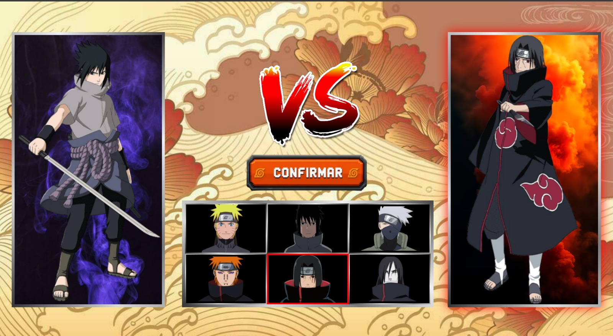
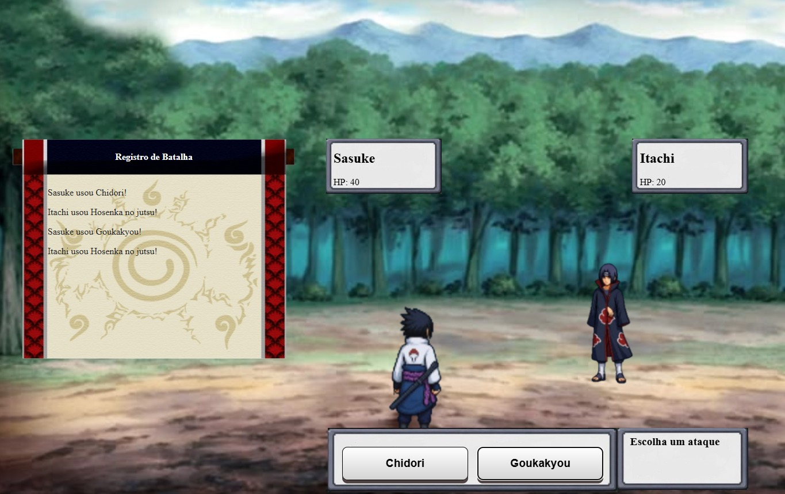

readme_content = """# 🍥 Naruto Pixel Battle Game - Front-end

> Um jogo de estratégia e combate por turnos totalmente interativo baseado no universo de Naruto, construído com foco em fluidez, gerenciamento de estado dinâmico e consumo de API REST.


               

## Sobre o Projeto
O **Naruto Pixel Battle Game** é uma aplicação web que simula confrontos entre os shinobis do anime. O projeto foi estruturado para fornecer uma experiência de usuário (UX) gamificada, dividida em fluxos claros e lógicos, consumindo a lógica de persistência e regras vindas da API em Java.

**Repositório do Back-end (API Java):** [Clique aqui para acessar o repositório do servidor](https://github.com/mtmattoz/ApiNaruto-Java.git)

## Fluxo da Aplicação & Telas

1. **Tela Inicial:** Apresentação do jogo com identidade visual imersiva do universo Naruto.
2. **Seleção de Personagens:** Aba interativa onde o jogador escolhe seu próprio personagem e define quem será o rival na disputa.
3. **Arena de Batalha (Combate por Turnos):** Mecânica central do jogo onde as ações acontecem de forma estratégica, alternando os turnos de ataque e defesa entre os shinobis com atualização de status em tempo real.
4. **Tela de Resultado (Vitória/Derrota):** Exibição dinâmica de um GIF temático correspondente ao ninja vitorioso da partida.
5. **Histórico de Partidas:** Seção dedicada para listar e revisar os resultados dos confrontos anteriores gravados no banco de dados.

## Tecnologias e Ferramentas Utilizadas
* **React** + **Vite** (Garantindo um build e HMR ultrarrápidos)
* **JavaScript (ES6+)** / **JSX**
* **[CSS3 / Tailwind CSS / Styled Components]**
* **[Axios ou Fetch API]** para requisições e consumo dos endpoints da API Java

## Funcionalidades em Destaque
* **Gerenciamento de Estado Complexo:** Controle preciso do fluxo do jogo (Início -> Seleção -> Batalha -> Resultado -> Histórico).
* **Lógica de Turnos no Front-end:** Alternância de estados e ações de combate calculadas de forma dinâmica.
* **Renderização Condicional:** Transição suave entre as telas com base no progresso do jogador.
* **Consumo de Mídia Dinâmica:** Renderização de GIFs customizados baseados no ID ou nome do personagem vencedor.

## Como executar o projeto localmente

### Pré-requisitos
Você precisará do Node.js (versão 18+ recomendada) e de um gerenciador de pacotes (`npm` ou `yarn`).
* Nota: Para carregar os dados dos personagens e salvar o histórico, certifique-se de que a [API em Java](https://github.com/mtmattoz/ApiNaruto-Java.git) esteja rodando em segundo plano.*

### Passo a passo

1. Clone o repositório:
```bash
git clone [https://github.com/mtmattoz/FrontApiNaruto.git]

cd nome-do-repositorio

npm install

npm run dev 
